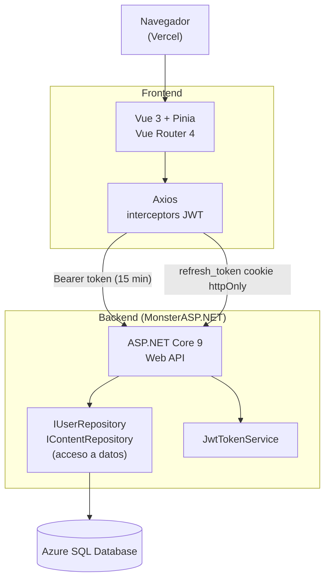

# MyVirtualAcademy

**LMS full stack construido desde cero como TFM del Máster en Desarrollo Full Stack + Multicloud.**

[](https://github.com/Danirolan21/myvirtualacademy-fullstack/actions/workflows/ci.yml)


---

## Demo en producción

| Entorno | URL |
|---------|-----|
| Frontend (Vercel) | https://myvirtualacademy.vercel.app |
| Backend — Swagger | https://myvirtualacademy.runasp.net/swagger |

> **Aviso — cold start:** la base de datos Azure SQL está en nivel serverless y se pausa tras un periodo de inactividad. El primer login después de un tiempo sin tráfico puede tardar entre 30 y 60 segundos. Es normal; los accesos posteriores responden con latencia habitual.

---

## Stack tecnológico

| Capa | Tecnología |
|------|------------|
| Frontend | Vue 3 + Vite + TypeScript, Pinia, Vue Router 4, Axios |
| Backend | ASP.NET Core 9 Web API, Entity Framework Core 9 |
| Base de datos | Azure SQL Database (esquema y scripts SQL versionados manualmente) |
| Autenticación | JWT en memoria + refresh token en cookie httpOnly, BCrypt 12 rounds |
| Tests | xUnit + Microsoft.AspNetCore.Mvc.Testing + EF Core InMemory + FluentAssertions 6.12 |
| CI | GitHub Actions (build + test backend, build frontend en cada push/PR) |
| Hosting frontend | Vercel |
| Hosting backend | MonsterASP.NET (.NET 9 nativo) |

---

## Funcionalidades por rol

### Administrador
- Dashboard con métricas globales: cursos activos, inscripciones, entregas pendientes y actividad reciente
- Gestión completa de cursos: crear, editar estado y portada, eliminar con cascade
- Gestión de asignaturas: crear, renombrar, eliminar, asignar y desasignar profesores
- Tabla de usuarios con toggle activo/inactivo, filtrado y registro de nuevos usuarios con rol
- Gestión de inscripciones: inscribir y desinscribir estudiantes por curso

### Profesor / Tutor
- Vista de tus cursos y asignaturas con estadísticas de temas y contenidos
- Acordeón de temas por asignatura; añadir y eliminar temas y contenidos (vídeo, documento, enlace, tarea)
- Tabla de entregas de estudiantes por tarea; calificar con puntuación y comentario de retroalimentación

### Estudiante
- Vista de asignaturas inscritas con barras de progreso por contenido completado
- Acceso a vídeos (YouTube embed o fichero local), documentos, enlaces externos
- Entrega y reentrega de tareas con countdown hasta la fecha límite

### Todos los roles
- Perfil unificado: edición inline de nombre, apellidos, teléfono y avatar; cambio de contraseña
- Notificaciones: campanita con badge de no leídas, polling cada 60 s; cada notificación navega al recurso relacionado (contenido, tarea, inscripción) al hacer click
- Calendario mensual con eventos filtrados por curso y tipo de contenido

### Sin autenticación
- Registro público de cuenta autoservicio en `/register` con auto-login tras crear la cuenta (rol Estudiante por defecto, rate-limited a 5 registros/hora por IP)

---

## Credenciales de demo

> **Aviso:** estas credenciales son públicas y dan acceso a un entorno de demostración compartido. Cualquier dato introducido puede ser modificado o eliminado por otros usuarios. La base de datos se restablece periódicamente.

| Email | Contraseña | Rol |
|-------|------------|-----|
| admin.supremo@tajamar365.com | admin | Administrador |
| paco.garciaserrano@tajamar365.com | paco | Profesor + Tutor |
| daniel.rodriguezlancha@tajamar365.com | lucialamejor | Estudiante |

---

## Estructura del repositorio

```
myvirtualacademy-fullstack/
├── back/
│   ├── MyVirtualAcademy.sln        Solución con API + Tests
│   ├── MyVirtualAcademy.API/
│   │   ├── Controllers/        Un controller por recurso (Auth, Courses, Subjects, Tasks…)
│   │   ├── Models/             Entidades EF Core y ViewModels
│   │   ├── Repositories/       IUserRepository, IContentRepository + implementación concreta
│   │   ├── Services/           JwtTokenService, NotificationService
│   │   └── Helper/             HelperPathProvider, HelperCryptography
│   ├── MyVirtualAcademy.API.Tests/ Proyecto xUnit con tests de integración
│   │                           (WebApplicationFactory + EF Core InMemory)
│   ├── migrations/             Scripts SQL incrementales numerados (001..006)
│   └── script.sql              DDL completo del esquema (referencia)
│
└── front/
    └── src/
        ├── api/             Módulos Axios por recurso (auth, courses, subjects…)
        ├── components/      AppNavBar, CourseCard, ContentForm, CountdownTimer…
        ├── router/          Vue Router 4 con guards de autenticación y rol
        ├── stores/          Pinia — auth store con silent refresh automático
        ├── types/           Interfaces TypeScript (Usuario, Curso, Asignatura…)
        ├── utils/           format.ts, images.ts (URLs absolutas al backend)
        └── views/           Vistas organizadas: auth/, admin/, profesor/, student/, content/, user/ + HomeView/CalendarView/NotFoundView
```

---

## Levantar el proyecto en local

### Requisitos

- .NET 9 SDK
- Node.js 20+ con npm
- SQL Server (SQLEXPRESS o cualquier instancia local)

### 1. Base de datos

Ejecuta el esquema inicial y las migraciones en orden:

```bash
sqlcmd -S LOCALHOST\SQLEXPRESS -d MyVirtualAcademy -i back/script.sql
sqlcmd -S LOCALHOST\SQLEXPRESS -d MyVirtualAcademy -i back/migrations/001_add_bcrypt_and_refresh_tokens.sql
sqlcmd -S LOCALHOST\SQLEXPRESS -d MyVirtualAcademy -i back/migrations/002_add_notifications.sql
sqlcmd -S LOCALHOST\SQLEXPRESS -d MyVirtualAcademy -i back/migrations/003_replace_notifications_table.sql
sqlcmd -S LOCALHOST\SQLEXPRESS -d MyVirtualAcademy -i back/migrations/004_ensure_isadmin_column.sql
sqlcmd -S LOCALHOST\SQLEXPRESS -d MyVirtualAcademy -i back/migrations/005_identity_migration_explicit.sql
sqlcmd -S LOCALHOST\SQLEXPRESS -d MyVirtualAcademy -i back/migrations/006_add_id_referencia_notificaciones.sql
```

Las migraciones 001–006 son obligatorias antes del primer arranque: 001 añade BCrypt/IsAdmin/RefreshTokens, 005 convierte las 8 tablas principales a IDENTITY (table-swap preservando IDs), 006 añade `ID_Referencia` a Notificaciones.

### 2. Backend

Crea el archivo `back/MyVirtualAcademy.API/appsettings.Development.json` con tus valores locales (no se commitea):

```json
{
  "ConnectionStrings": {
    "SqlMyVirtualAcademy": "Data Source=LOCALHOST\\SQLEXPRESS;Initial Catalog=MyVirtualAcademy;..."
  },
  "JwtSettings": {
    "SecretKey": "tu-secreto-de-al-menos-32-caracteres"
  },
  "AllowedOrigins": ["http://localhost:5173"]
}
```

```bash
cd back
dotnet restore MyVirtualAcademy.sln
dotnet run --project MyVirtualAcademy.API
```

API disponible en `http://localhost:5100`. Swagger en `http://localhost:5100/swagger`.

### 3. Frontend

```bash
cd front
cp .env.example .env.local   # solo la primera vez
npm install
npm run dev
```

App disponible en `http://localhost:5173`. El proxy de Vite redirige `/api/*` al backend en desarrollo, sin necesidad de configurar CORS.

### 4. Ejecutar los tests

```bash
cd back
dotnet test
```

Los tests usan EF Core InMemory + secret JWT hardcodeado en la `CustomWebApplicationFactory` — son autocontenidos, no requieren BD ni configuración local.

---

## Variables de entorno

### Backend

Configuradas como variables de entorno del sistema en producción (o en `appsettings.Development.json` en local):

| Variable | Descripción |
|----------|-------------|
| `ConnectionStrings__SqlMyVirtualAcademy` | Connection string de SQL Server |
| `JwtSettings__SecretKey` | Clave secreta JWT (mínimo 32 caracteres) |
| `JwtSettings__Issuer` | Issuer del token (por defecto: `MyVirtualAcademy`) |
| `JwtSettings__Audience` | Audience del token (por defecto: `MyVirtualAcademyUsers`) |
| `JwtSettings__AccessTokenExpiryMinutes` | Duración del access token (por defecto: 15) |
| `JwtSettings__RefreshTokenExpiryDays` | Duración del refresh token (por defecto: 7) |
| `AllowedOrigins__0` | Origen del frontend para CORS (ej. `https://tu-app.vercel.app`) |

### Frontend

Ver `front/.env.example`:

| Variable | Descripción |
|----------|-------------|
| `VITE_API_URL` | URL base del backend sin barra final (ej. `https://myvirtualacademy.runasp.net`) |

En desarrollo no es necesaria si se usa el proxy de Vite.

---

## Arquitectura



**Flujo de autenticación:**
1. Login → acceso JWT en body (almacenado en memoria/sessionStorage) + refresh token en cookie httpOnly
2. Cada petición adjunta el Bearer token en el header `Authorization`
3. En 401, el interceptor de Axios llama a `POST /api/auth/refresh` usando la cookie y renueva el token de forma transparente

---

## Estado del proyecto

Funcionalidad principal completa para los tres roles. El proyecto se desarrolló como TFM partiendo de un monolito ASP.NET Core MVC y migrando a arquitectura desacoplada API REST + SPA.

**Limitaciones conocidas:**
- Módulo de exámenes pendiente (stub en frontend y backend)
- Sin paginación en listados largos
- Sin búsqueda o filtrado de contenidos dentro de una asignatura
- Cobertura de tests inicial (5 tests de integración sobre auth y content); resto de endpoints (cursos, asignaturas, temas, tareas, calificaciones, notificaciones) sin cobertura aún
- Los archivos subidos por usuarios (avatares, entregas, portadas de curso) se almacenan en disco local del servidor. En MonsterASP.NET el almacenamiento es persistente, pero migrar a un entorno containerizado o serverless requeriría almacenamiento externo (S3, Azure Blob, etc.)

---

## Licencia

Sin licencia explícita por ahora. Todos los derechos reservados.
